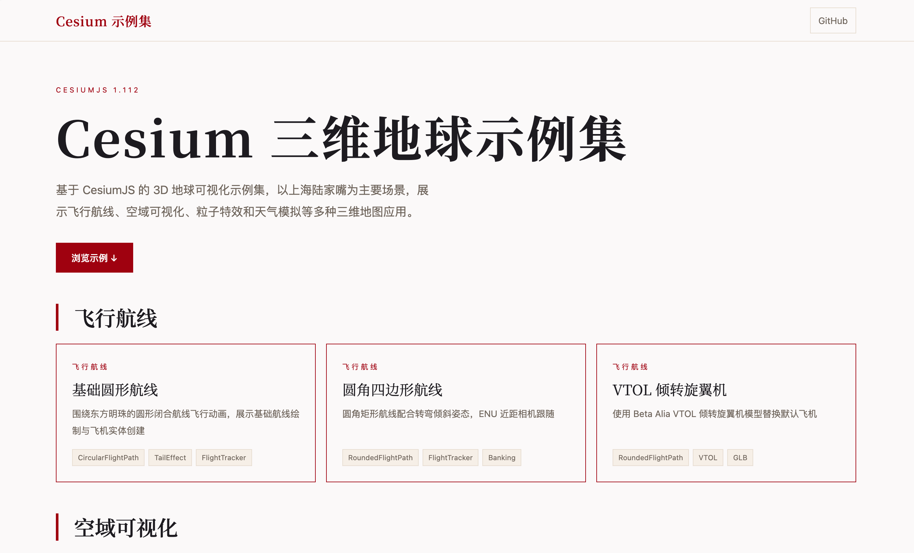

<div align="center">



# 🌍 Cesium 三维地球示例集

基于 CesiumJS 的 3D 地球可视化示例集，以上海陆家嘴为主要场景，<br>展示飞行航线、空域可视化、粒子特效和天气模拟

[](https://cesium.com/platform/cesiumjs/)
[](./LICENSE)
[](https://yuwb.dev/cesium/)

[在线预览](https://yuwb.dev/cesium/) · [快速开始](#-快速开始) · [示例说明](#-示例说明)

</div>

---

## ✨ 功能特性

- 🛫 **飞行动画** — 圆形 / 圆角四边形航线，转弯倾斜姿态，ENU 近距相机跟随
- 🏙️ **3D 建筑** — OSM 建筑自定义着色器，扫描线效果，日夜切换
- ✈️ **空域可视化** — 虹桥 / 浦东 B 类空域分层 3D 展示，玻璃拟态控制面板
- 🔥 **粒子特效** — 火焰 / 烟雾 / 气流三种效果切换与强度调节
- ⛈️ **天气模拟** — 雷雨云团 / 细雨 / 闪电，多预设切换
- 📦 **模块化架构** — 共享模块 + 编排层，示例间代码复用

## 🚀 快速开始

```bash
# 克隆项目
git clone https://github.com/zhijian521/cesium-example.git
cd cesium-example

# 启动本地服务（任选一种）
python3 -m http.server 8080
# 或
npx serve .

# 浏览器访问
open http://localhost:8080
```

> **注意：** 项目为纯静态 HTML，无需安装依赖或构建步骤，本地 HTTP 服务即可运行。

## 📸 示例说明

<table>
<tr>
<td width="50%">

### ✈️ 飞行航线

**01-flight-basic** — 基础圆形航线
围绕东方明珠的圆形闭合航线飞行动画，展示航线绘制、飞机实体创建与尾部预警特效

**01-flight-rounded** — 圆角四边形航线
圆角矩形航线配合转弯倾斜姿态与螺旋桨动画，ENU 局部坐标系精确相机跟随

</td>
<td width="50%">

### 🏙️ 空域可视化

**02-airspace** — B 类空域可视化
虹桥（双跑道）与浦东（五跑道）机场 B 类空域分层 3D 可视化，依据《国家空域基础分类方法》，含玻璃拟态控制面板

### 🔥 粒子特效

**03-particles** — 飞机粒子特效
飞机航线上的粒子效果展示，支持火焰 / 烟雾 / 气流三种效果切换与强度调节

### ⛈️ 天气模拟

**04-weather** — 雷雨云天气
航线周边叠加雷雨天气（云团、细雨、闪电），支持 drizzle / rainstorm / darkStorm 预设切换

**04-weather-cloud** — 云模型加载
加载 rain_1.glb 云模型，独立展示与视角控制

</td>
</tr>
</table>

## 🏗️ 架构

项目采用 **共享模块 + 编排层** 模式，每个示例的 `main.js` 仅保留业务编排逻辑，通用功能抽取到 `shared/` 模块：

```
shared/
├── styles/
│   └── flight-style.css          ← 玻璃拟态公共样式
├── config/
│   ├── cesium-config.js          ← Cesium 全局配置
│   ├── cesium-bootstrap.js       ← Viewer 启动助手
│   └── constants.js              ← 坐标、着色器、配置常量
├── SceneManager.js               ← 场景初始化 / 建筑 / 日夜切换
├── CircularFlightPath.js         ← 圆形航线 + 飞机实体
├── RoundedFlightPath.js          ← 圆角矩形航线 + banking 姿态
├── FlightTracker.js              ← 飞行面板 / 相机跟随 / 滚轮缩放
└── TailEffect.js                 ← 尾部预警波纹特效
```

## 📁 项目结构

```
.
├── index.html                    ← 主页（知简设计系统）
├── site.config.js                ← 站点配置（名称、URL、示例列表）
├── sitemap.xml                   ← SEO Sitemap
├── robots.txt                    ← SEO Robots
├── assets/
│   ├── icon.png                  ← 项目图标
│   ├── home.png                  ← 封面图
│   ├── images/
│   └── models/
│       ├── beta-alia/            ← 飞机模型
│       └── weather/              ← 云模型
├── examples/
│   ├── 01-flight-basic/
│   ├── 01-flight-rounded/
│   ├── 02-airspace/
│   ├── 03-particles/
│   ├── 04-weather/
│   └── 04-weather-cloud/
└── shared/
    ├── styles/
    ├── config/
    ├── SceneManager.js
    ├── CircularFlightPath.js
    ├── RoundedFlightPath.js
    ├── FlightTracker.js
    └── TailEffect.js
```

## 🛠️ 技术栈

| 技术 | 说明 |
|------|------|
| [CesiumJS 1.112](https://cesium.com/platform/cesiumjs/) | 3D 地球与地图可视化引擎 |
| [Noto Serif SC](https://fonts.google.com/noto/specimen/Noto+Serif+SC) | 衬线中文字体（标题） |
| 原生 HTML / CSS / JS | 无框架、无构建工具、纯静态 |

## 📄 许可证

[MIT License](./LICENSE)
